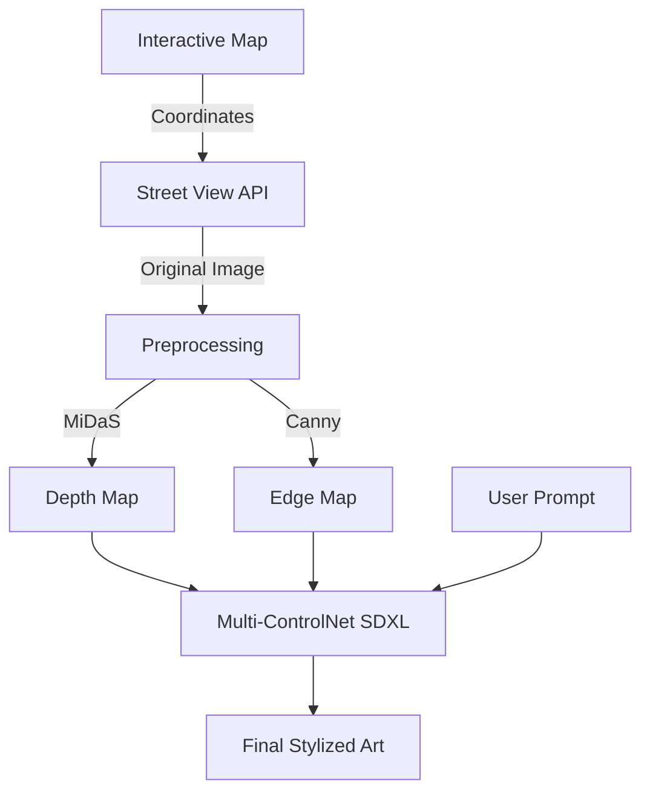

# 🌍 GeoCanvas

[](https://github.com/LakshmidharKotipalli/geo-canvas/stargazers)
[](LICENSE)
[](https://www.python.org/)
[](https://nextjs.org/)
[](https://tailwindcss.com/)

**Transform any real-world location into AI-generated art.** GeoCanvas fetches Google Street View imagery for given coordinates, extracts depth and edge maps, and generates stylized images using **Stable Diffusion XL** with **multi-ControlNet conditioning** to preserve spatial structure.

---

## ✨ Key Features

- **📍 Global Exploration**: Pick any location on an interactive Leaflet map.
- **🖼️ Street View Integration**: Real-world imagery via Google Street View Static API.
- **🤖 Dual-ControlNet Pipeline**:
  - **MiDaS Depth Estimation**: Preserves 3D spatial relationships.
  - **Canny Edge Detection**: Maintains architectural lines and structural boundaries.
- **🎨 Creative Control**: Use professional presets (Cyberpunk, Watercolor, Cinematic) or write your own prompts.
- **⚡ Performance Optimized**: FP16 precision, lazy model loading, and GPU memory offloading.
- **🛠️ Zero-Config Demo Mode**: Works without Google API keys for quick testing.

---

## 🏗️ Technical Architecture

### Why ControlNet?
Unlike standard `img2img` which is tightly coupled to original colors, **ControlNet** provides structural conditioning. This allows GeoCanvas to transform a daytime street photo into a neon-lit cyberpunk city while keeping buildings and roads in their exact real-world positions.



---

## 🚀 Getting Started

### Prerequisites

- **Python 3.10+**
- **Node.js 18+**
- **NVIDIA GPU** (12GB+ VRAM recommended for SDXL)

### 1. Clone & Setup

```bash
git clone https://github.com/LakshmidharKotipalli/geo-canvas.git
cd geo-canvas
```

### 2. Backend Installation

```bash
cd backend
python -m venv venv
source venv/bin/activate  # Windows: venv\Scripts\activate
pip install -r requirements.txt
cp .env.example .env
```

*Edit `.env` to add your optional `GOOGLE_MAPS_API_KEY`.*

### 3. Frontend Installation

```bash
cd ../frontend
npm install
```

### 4. Running the Application

Use the convenience scripts:
```bash
./start.sh
```
Or run manually:
- **Backend**: `uvicorn app.main:app --reload --port 8000` (in `backend/`)
- **Frontend**: `npm run dev` (in `frontend/`)

---

## 🛠️ Tech Stack

### AI & Computer Vision
- **Stable Diffusion XL**: State-of-the-art image generation.
- **ControlNet (Depth + Canny)**: Structural conditioning.
- **MiDaS (DPT-Large)**: Monocular depth estimation.
- **OpenCV**: Edge detection and image processing.
- **HuggingFace Diffusers**: ML pipeline orchestration.

### Web Stack
- **FastAPI**: High-performance Python backend.
- **Next.js 15**: React framework for the frontend.
- **TypeScript**: Type-safe development across the stack.
- **Tailwind CSS**: Modern utility-first styling.
- **Leaflet**: Open-source interactive maps.

---

## 📂 Project Structure

```text
geo-canvas/
├── backend/                # FastAPI Python backend
│   ├── app/                # Core logic, routers, and services
│   └── requirements.txt    # Python dependencies
├── frontend/               # Next.js + TypeScript frontend
│   ├── src/app/            # Application routes
│   └── src/components/     # Reusable UI components
├── start.sh                # Launch script
└── README.md               # You are here
```

---

## 🤝 Contributing

Contributions are welcome! Please feel free to submit a Pull Request.

1. Fork the Project
2. Create your Feature Branch (`git checkout -b feature/AmazingFeature`)
3. Commit your Changes (`git commit -m 'Add some AmazingFeature'`)
4. Push to the Branch (`git checkout -b feature/AmazingFeature`)
5. Open a Pull Request

---

## 📜 License

Distributed under the MIT License. See `LICENSE` for more information.

---

*Built with ❤️ by [Lakshmidhar Kotipalli](https://github.com/LakshmidharKotipalli)*
